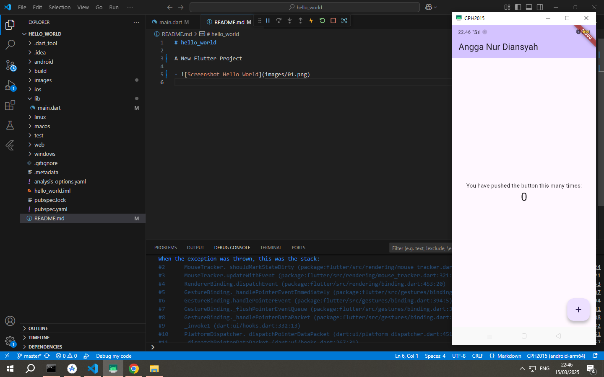
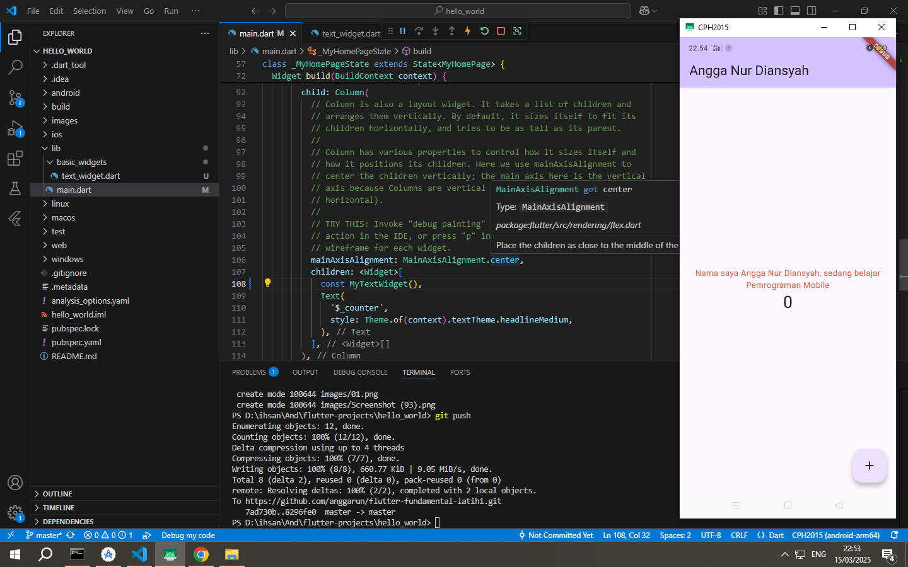
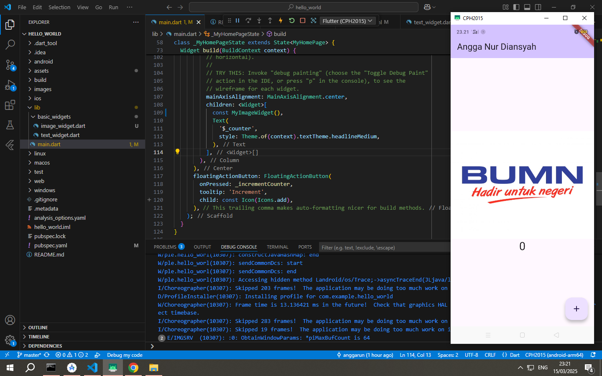
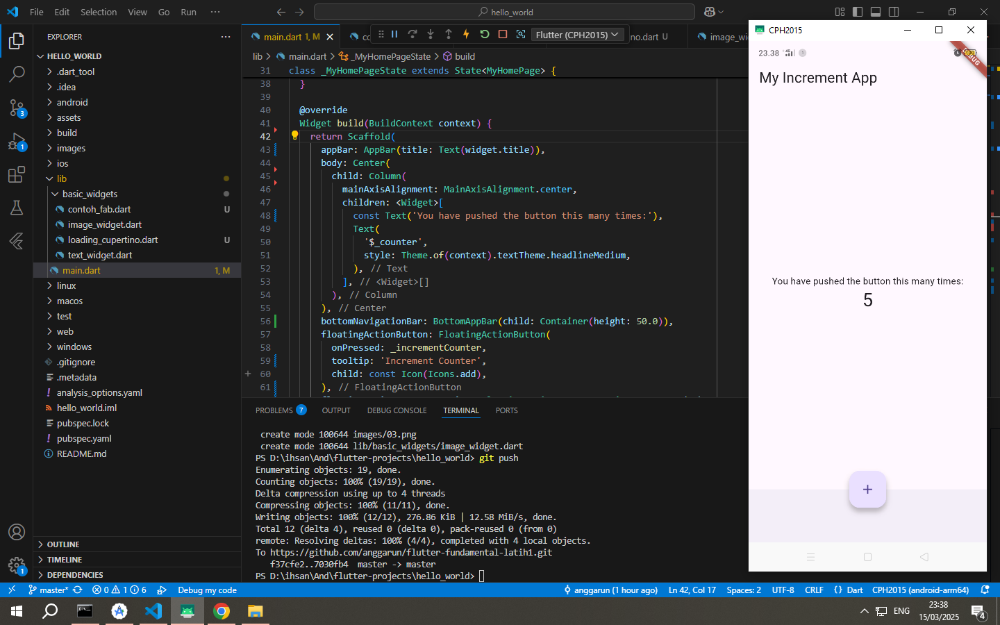
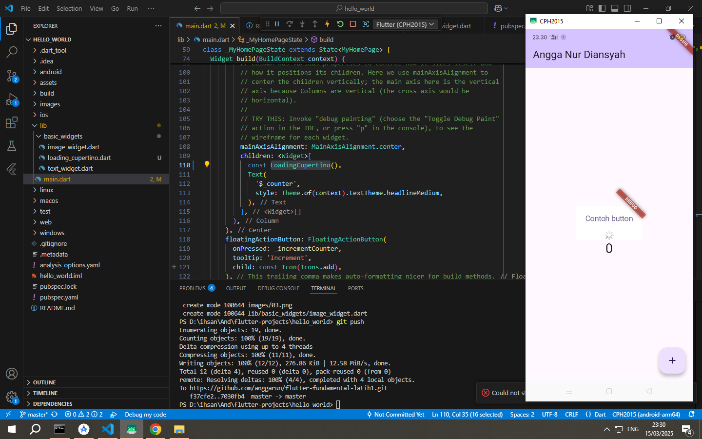
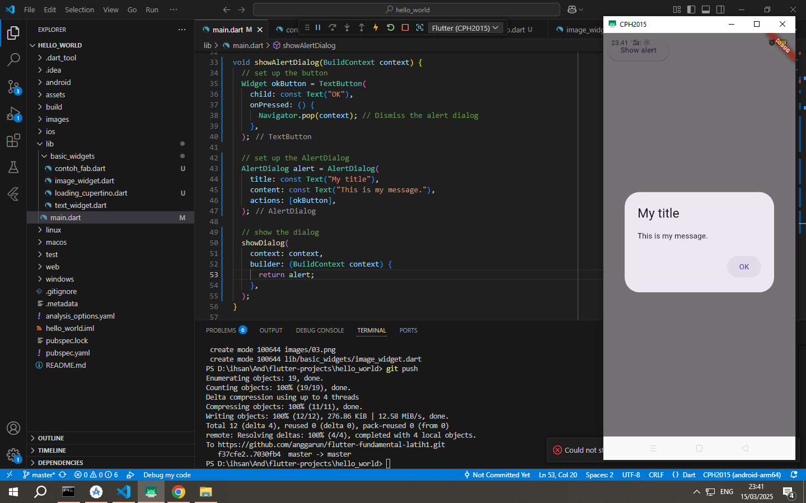
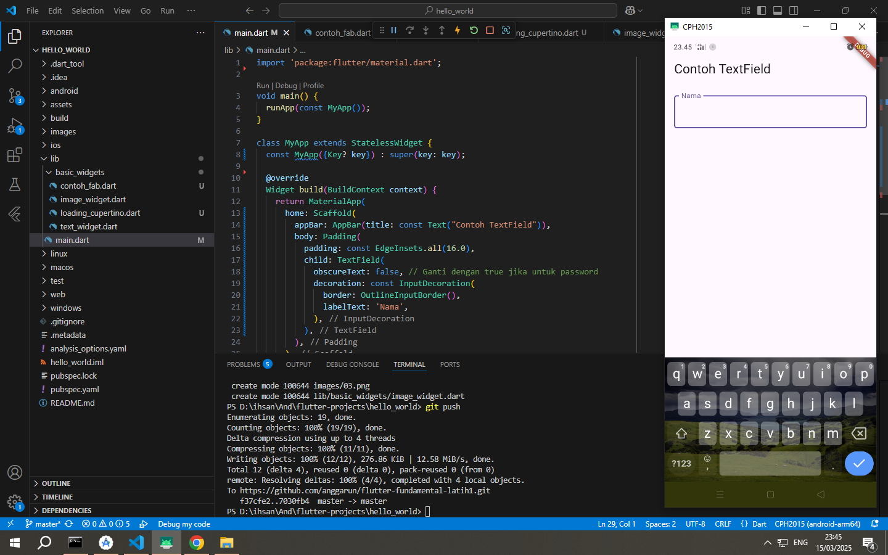
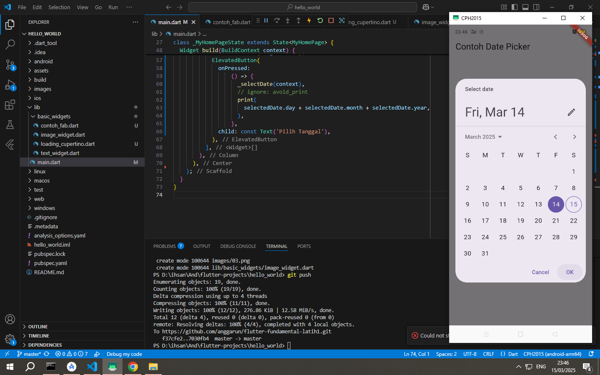

# Hello World

A New Flutter Project

## Praktikum 3
### Halaman Awal Project Flutter
- 
  - **Penjelasan**: Ini adalah tampilan awal proyek Flutter yang pertama kali dijalankan pada perangkat Sayaa. Halaman ini menunjukkan tampilan default dari aplikasi Flutter yang baru saja dibuat. Saya hanya mengubah text pada appBar dengan nama saya.

## Praktikum 4
### Menggunakan Text Widget
- 
  - **Penjelasan**: Pada gambar ini, ditampilkan contoh penggunaan `Text` widget dalam Flutter. Text ini diambil dari file terpisah, yang mengilustrasikan cara memisahkan kode dan menggunakan widget dari file yang berbeda untuk memudahkan pengelolaan aplikasi.

### Menampilkan Gambar pada Flutter
- 
  - **Penjelasan**: Gambar ini menunjukkan cara menampilkan gambar di aplikasi Flutter. Gambar tersebut diambil dari folder `images` dengan nama `logo.jpg`. Widget `Image.asset` dalam basic_widgets\image_widget.dart digunakan untuk memuat gambar tersebut dari file lokal.

## Praktikum 5
### Scaffold Widget
- 
  - **Penjelasan**: Di sini kita melihat penggunaan `Scaffold` widget, yang merupakan struktur dasar dari halaman aplikasi Flutter. Scaffold menyediakan kerangka kerja untuk elemen-elemen seperti AppBar, body, drawer, dan lainnya.

### Menggunakan Cupertino dan Button Widget
- 
  - **Penjelasan**: Screenshot ini menunjukkan penggunaan `Cupertino` style widget, yang memberi tampilan khas iOS pada aplikasi Flutter. Juga, ada contoh penggunaan tombol (`Button`) dalam aplikasi Flutter.

### Dialog Box
- 
  - **Penjelasan**: Gambar ini menampilkan penggunaan `Dialog` dalam aplikasi Flutter. Dialog digunakan untuk menampilkan informasi atau meminta interaksi dari pengguna.

### Input Field
- 
  - **Penjelasan**: Screenshot ini menunjukkan contoh penggunaan `TextField` widget untuk menerima input dari pengguna. Ini adalah widget dasar yang digunakan dalam formulir input.

### Date Picker
- 
  - **Penjelasan**: Pada gambar ini, ditunjukkan cara menggunakan `DatePicker` widget di Flutter untuk memungkinkan pengguna memilih tanggal dari sebuah kalender.
